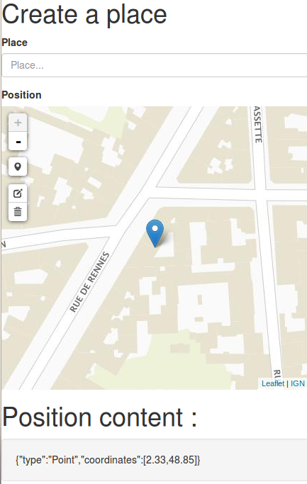
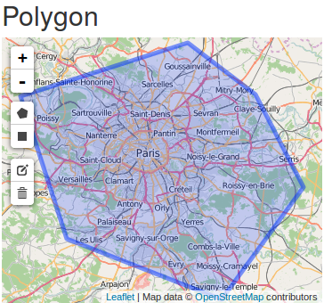
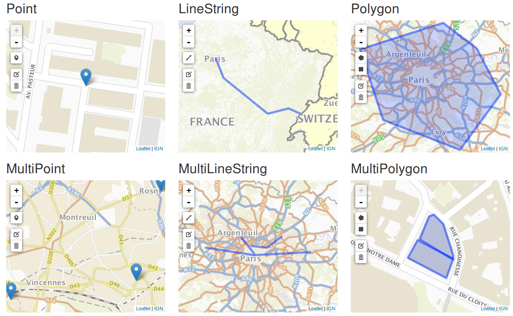

# JQuery Geometry Editor


## Motivation

When a date is needed is an HTML form, we simply use a [Datepicker](https://jqueryui.com/datepicker/). What about the same approach to edit or display [points, paths, polygons](http://geojson.org/geojson-spec.html#appendix-a-geometry-examples) on a map?

```
$('#position').geometryEditor({
    height: 400,
    type: 'Point'
});
```



A polygon in another form?

```
$('#place').geometryEditor({
    height: 400,
    type: 'Polygon'
});
```




## Why?

Usual approach is to write a specific API to handle GeoJSON feature collections (a table with a geometry column).

Here, a geometry is nothing more than a property with specific format (like dates with YYYY-mm-DD). Consequently, it's easier to integrate a spatial aspect in existing forms or API.


## How does it work?

* A [leaflet](http://leafletjs.com/) map is initialized with background layers
* The geometry is parsed from the source element (an input field or an html element)
* The geometry is added to a draw layer
* [Leaflet.draw controls](https://github.com/Leaflet/Leaflet.draw#using) are enabled according to the geometry type restriction
* When the map is edited, the geometry is serialized back to the source element

Moreover, this component ensure that the user draw a single point when you want a single point : For single geometries (Point, LineString, olygon, Rectangle), insertions are converted to replacements.


## GeometryEditor options

### Basic options

#### *width* (string|number)

The map width (ex : '500', default '100%')

#### *height* (string|number)

The map height

#### *tileLayers* (Object[])

An array corresponding to background layers :

```
tileLayers: [
   {
       url: "http://{s}.tile.openstreetmap.org/{z}/{x}/{y}.png",
       attribution: 'Map data © <a href="http://openstreetmap.org">OpenStreetMap</a> contributors'
   }
]
```


### Edit options

#### *editable* (boolean)

GeometryEditor acts as a geometry viewer when edition controls are disabled :

```
$('#geometry').geometryEditor({
    editable: false
});
```

#### *geometryType* (enum)

This  provides a restriction on geometry edition :

* Geometry (default) : Any geometry type
* Point
* LineString
* Polygon
* MultiPolygon
* MultiLineString
* MultiPolygon
* GeometryCollection
* Rectangle (bounding box)




Note that :
* Adding geometries leads to replacement for single geometries (Point, LineString, Polygon)
* Circles are disabled for a while

## Global customization

Default parameters are exposed throw the variable ```ge.defaultParams```. 

See example/customize-geoportal.js :

```
ge.defaultParams.tileLayers = [
{
    url: getGeoportalURL("GEOGRAPHICALGRIDSYSTEMS.PLANIGN"),
    attribution: '<a href="#">IGN</a>'
}
]
```

## Advanced use


### Retrieve the geometry editor

The GeometryEditor is attached to the input field and can be retrieved :

```
// Get GeometryEditor
$('#geometry').data('editor')
```

### GeometryEditor component

WARNING : GeometryEditor interface is not yet really stable.

```
var geometryEditor = new GeometryEditor(
    document.getElementById('position'),
    {
        geometryType: 'Point'
    }  
);
```


## Server side

Compared to approaches relying exclusively on the use of [features collections](http://geojson.org/geojson-spec.html#examples), geometries can be considered as classic HTML form fields.

Meanwhile, a specific conversion is required to store this geometries in PostGIS for example (see [ST_GeomFromGeoJSON](http://postgis.net/docs/ST_GeomFromGeoJSON.html) and [ST_AsGeoJSON](http://postgis.net/docs/manual-dev/ST_AsGeoJSON.html)).

You may also use [MongoDB where GeoJSON is the native storage format for geometries](https://docs.mongodb.org/manual/reference/operator/query/geometry/).

## Standard conformance

Point, LineString, Polygon, MultiPoint, MultiLineString, MultiPolygon, GeometryCollection are part of the standard [Simple Feature Access](http://www.opengeospatial.org/standards/sfa).

To sum it up : The produced geometries can be stored in spatial databases, processed with GIS, rendered with tools like geoserver/mapserver/mapnik,...

## Dependencies

* [JQuery](https://jquery.com/)
* [leaflet](http://leafletjs.com/) : Open-source JavaScript library for mobile-friendly interactive maps
* [leaflet-draw](https://github.com/Leaflet/Leaflet.draw) : Vector drawing and editing plugin for Leaflet
* [TurfJS](https://github.com/Turfjs) : Geometry manipulation

Exemples use either [OSM tiles](http://www.openstreetmap.org/copyright) or [IGN geoportal](http://www.geoportail.gouv.fr) (see [Conditions générales](http://api.ign.fr/conditions-generales)) (French).


## TODO

### Behavior to improve

* Input geometries are not filtered according to geometryType

### Future features

* Multiple tileLayers
* Events to simplify customization (such as adding navigation control)
* Optional "format" : GeoJSON (default), WKT (easier to integrate with PostGIS).
