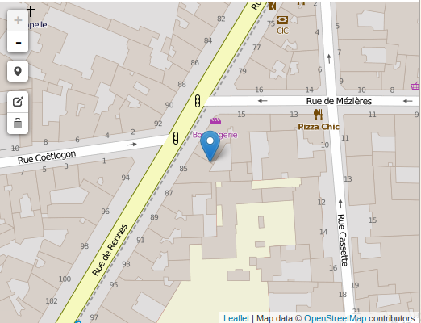

# JQuery Geometry Editor

## Motivation

When a date is needed is an HTML form, we simply pick a [Datepicker](https://jqueryui.com/datepicker/). When it's a shape : We write GeoJSON REST APIs and code client based on leaflet, openlayers, etc.

What about a new approach?

* Create a classic form with a serialized Geometry :

```
<form>
    <!-- a form field -->
    Place name : <input type="text" name="name" value="The name" />
    <!-- a serialized geometry -->
    Position : <textarea id="position" name="position"
    >
    {
        "type": "Point",
        "coordinates": [5.0,45.0]
    }
    </textarea>
</form>
```

* Enable geometry editor :

```
$('#position').geometryEditor({
    width: '100%',
    height: 400,
    type: 'Point'
});
```

* Get the form :

<input type="text" name="name" value="The name" />



## Dependencies

* [JQuery](https://jquery.com/)
* [leaflet](http://leafletjs.com/) : Open-source JavaScript library for mobile-friendly interactive maps
* [leaflet-draw](https://github.com/Leaflet/Leaflet.draw) : Vector drawing and editing plugin for Leaflet
* [leaflet-omnivore](https://github.com/mapbox/leaflet-omnivore) : Universal format parser for Leaflet & Mapbox.js

## Viewer mode

Controls can be disabled to get a geometry viewer :

```
$('#geometry').geometryEditor({
    editable: false
});
```

See :

* [Basic example (bundle, i.e. built in dependencies)](example/basic.html)
* [Basic example (external dependencies)](example/basic-without-bundle.html)


## Supported geometry types

* Point
* LineString
* Polygon
* MultiPoint
* MultiLineString
* MultiPolygon
* GeometryCollection

## Advanced use

### Retrieve the geometry editor

The GeometryEditor is attached to the input field and can be retrieved :

```
// Get GeometryEditor
$('#geometry').data('editor')
```

## GeometryEditor options

### Basic options

* width (string|number)

The map width (ex : '500', default '100%')

* height (string|number)

The map height

### Edit options

* editable (boolean)

* Option "geometryType" (enum)

Type provides a restriction on geometry edition and supports the following values :

* Geometry : Any geometry type
* Point
* LineString
* Polygon
* MultiPolygon
* MultiLineString
* MultiPolygon
* GeometryCollection (default) : all geometries are supported

Note that :
* Adding geometries leads to replacement for single geometries (Point, LineString, Polygon)


## TODO

### Bugs

* Input geometries are not filtered according to geometryType
* Output geometries are not fully normalized according to geometryType

### Features

Restrict edition to the given type.

* Options "format"

GeoJSON (default)|WKT (easier to integrate with PostGIS).

### Clear and test code

* Rely only on npm for the build
* Test
    * FeatureCollection to Geometry
